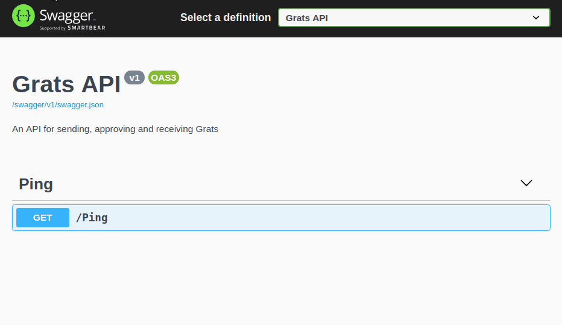
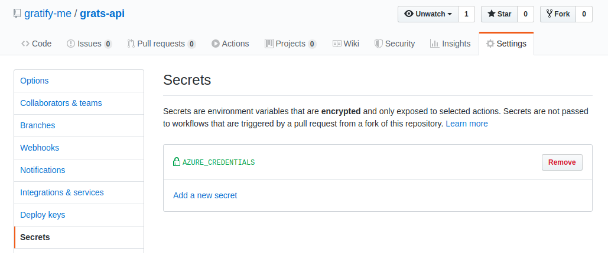

Gratify.Api
===========
_An API for sending, approving and receiving Grats._


Getting started
---------------

### Installation
You'll need the following tools to get started:
* [Git](https://git-scm.com/downloads)
* [.NET Core 3.1 or later](https://dotnet.microsoft.com/download)

In addition you'll need a tool for editing C# code. [VS Code](https://code.visualstudio.com/download) with the [C# extension](https://marketplace.visualstudio.com/items?itemName=ms-vscode.csharp) is a nice option.

If you want to run the deploy scripts locally, you'll also need to install [Azure CLI](https://docs.microsoft.com/en-us/cli/azure/install-azure-cli?view=azure-cli-latest).

### Cloning, building and testing
Start by cloning this repo:
```shell
$> git clone https://github.com/gratify-me/grats-api.git
```

Then navigate into the `grats-api/Gratify.Api/` folder and start the application with `dotnet run`:
```shell
$ Gratify.Api> dotnet run
```

Open your favorite browser, and navigate to [localhost:5001/swagger](https://localhost:5001/swagger). This should open [Swagger UI](https://swagger.io/tools/swagger-ui/), where you can try out the API.



If you want to run the tests, navigate into the `grats-api/Gratify.Api.Test/` folder and run `dotnet test`:
```shell
$ Gratify.Api.Test> dotnet test
```

Configuration
-------------

### Development configuration
If you wish to override any of the configuration values when developing, create a new file in `/Gratify.Api` called `appsettings.Development.json`, and copy the contents of [Gratify.Api/appsettings.json](Gratify.Api/appsettings.json) into this file.

Any setting in `appsettings.Development.json` will override the settings in `appsettings.json`, but `appsettings.Development.json` is ignored by git, so you're less likely to check in secrets to source control.

### DatabaseSettings
**UseInMemory** specifies if the application should use an in-memory database instead of connecting to a persistent SQL database. It should always be set to `false` when the application is deployed, but it set to `true` in [Gratify.Api/appsettings.json](Drops.Api/appsettings.json), in order to better facilitate local development. When using an in-memory database, no state is persisted between restart of the application.

**ApplyMigrations** determines if the application should check for pending database migrations on startup, and apply them to the database. Should not be used with an in-memory database, since the in-memory database don't require migrations.

**ConnectionString** is the connection information used to connect to a SQL database. Is not needed for an in-memory database, and should never be checked in to Git.

Continous Integration
---------------------

Continous Integration (CI) is handles by [GitHub Actions](https://help.github.com/en/actions), and the [built in Azure actions](https://github.com/Azure/actions) handles creation of [resource groups](https://docs.microsoft.com/en-us/azure/azure-resource-manager/resource-group-overview), as well as deployment of [ARM templates](https://docs.microsoft.com/en-us/azure/azure-resource-manager/resource-group-authoring-templates) and applications.

### Generating secrets
In order for the CI workflow to be able to login to Azure, the secret `AZURE_CREDENTIALS` has to be set.



To generate the credentials, you'll have to generate a new service principal as shown below:
```shell
$> az ad sp create-for-rbac \
    --name "GitHubDeployment" \
    --role contributor \
    --scopes /subscriptions/{subscription-id} \
    --sdk-auth
```

The subscription-id can be found by running `az account show`.

You can further scope down the Azure Credentials to the service principal by using the scopes attribute. For example, using `/subscriptions/{subscription-id}/resourceGroups/{resource-group}` would restrict access to a given resource group.

The output of `az ad sp create-for-rbac` should be a json object, containing the login information for the GitHubDeployment service principal. Use this json object as the value for the `AZURE_CREDENTIALS` secret.
```json
{
  "clientId": "<GUID>",
  "clientSecret": "<GUID>",
  "subscriptionId": "<GUID>",
  "tenantId": "<GUID>",
  (...)
}
```

You can view the registered service principal in the Azure portal, by lookin at the [App registrations blade](https://portal.azure.com/#blade/Microsoft_AAD_IAM/ActiveDirectoryMenuBlade/RegisteredApps) under Azure Active Directory.

Database Changes
----------------

Database schema changes is managed using [EF Core migrations](https://docs.microsoft.com/en-us/ef/core/managing-schemas/migrations/). The following steps describe how database changes are created and applied:
1. A change is made that requires a database schema change. Usually this involves a change in one of the entities in the `Gratify.Api.Database.Model` namespace.
2. A new database migration is created using `dotnet ef migrations add`.
3. The generated migration files are checked in along with other changes.
4. When the API is released, `MigrationService` will execute on startup, and any pending migrations are applied to the database.

### Creating a new database migration
The [.NET Core tool](https://docs.microsoft.com/en-us/dotnet/core/tools/global-tools) `dotnet ef` must be installed, in order to create new migrations. You can install this globally on your machine using the following command:

```shell
$> dotnet tool install --global dotnet-ef
```

Before creating a new migration, you need configure the API with connection strings to the database. You also need to set `UseInMemory` and `ApplyMigrations` to `false`.

```json
"DatabaseSettings": {
    "UseInMemory": false,
    "ApplyMigrations": false,
    "ConnectionString": "<development database connection string>"
}
```

Now you can create a new migration using `dotnet ef migrations add`. This will create a new migration under the `/Gratify.Api/Migrations` folder. These files should be checked in.

```shell
$ Gratify.Api> dotnet ef migrations add <Description of database change>
```

### Debugging failed database migrations
If a migration fails, you might want to debug the migration locally. This can be done by configuring the API with the database connection string, and setting `ApplyMigrations` to `true`.

```json
"DatabaseSettings": {
    "UseInMemory": false,
    "ApplyMigrations": true,
    "ConnectionString": "<database connection string>"
}
```

Now you can run Gratify.Api, and it'll try to apply the migrations in the same way that it does when it's deployed to the development environment. You should now be able to debug the problem locally and hopefully fix it.

_**Beware:** Setting `ApplyMigrations` to `true` while running the API against a database will migrate the database. This should be done with caution, since it can crash the already deployed version of the API, or irreversibly destroy data._

When you're done debugging, you'll usually want to [revert the migration](https://docs.microsoft.com/en-us/ef/core/managing-schemas/migrations/?tabs=dotnet-core-cli#revert-a-migration), so the actual migration will be preformed during the release.
